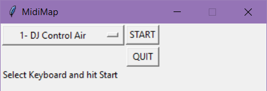
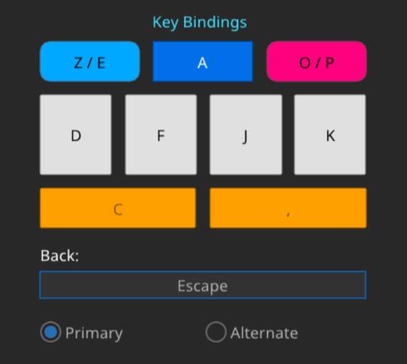
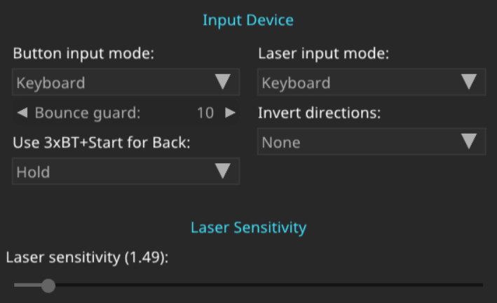

# SVDX Midi Mapper
Custom Python mapper for Midi-based controller in SVDX.

[MidiMap.py](MidiMap.py) is the main file, where the midi loop and config is done.

[winkeys.py](winkeys.py) is a custom input wrapper for sending keyboard keys

[play!.bat](play!.bat) is my shortcut to launch [USC](https://github.com/Drewol/unnamed-sdvx-clone) or SVDX.

# Usage
0. Install [Python](https://www.python.org/downloads/) and the `requirements.txt`
    - With `python -m pip install -r requirements.txt`. Can use it under VENV if you want, and edit the "[play!.bat](play!.bat)" if so.
1. Put the files into your [USC](https://github.com/Drewol/unnamed-sdvx-clone) game folder (where `usc-game.exe` is located)
2. Launch the "[play!.bat](play!.bat)", you should get this window :

   
(If no device are selected, click on the scroll menu and choose your device)
3. Click "START" and get right into the game !

At this point the only way to exit property is to click "Quit" and wait a MIDI polling cycle.

## USC Key Config



And the super awesome ASCII version :
````
( Z/E )  [  A  ]  ( O/P )

[ D ] [ F ]   [ J ] [ K ]

[    C    ]   [    ,    ]
````



## Adding your own device
Theoretically it's easy: I mapped all my MIDI keyboards with this file (hence the messiness).
I should recommend you to take a look at [MidiMap.py](MidiMap.py) and read the comments. If you can't read my mess, DM me or open an issue and I'll try to help :D

## Custom Key Mapping
Take a look at [winkeys.py](winkeys.py), but this feature wasn't planned when I built this ... 

# Extras
Part of the console during a game :
```
...
Got key : [[176, 48, 127, 0], 9169345]
MAP OF
is_spin
Spin Z
Got key : [[144, 52, 127, 0], 9169388]
MAP OF DOWN
Got key : [[144, 52, 0, 0], 9169518]
MAP OF DOWN
Got key : [[144, 52, 127, 0], 9170314]
MAP OF DOWN
Got key : [[144, 52, 0, 0], 9170458]
MAP OF DOWN
Got key : [[176, 48, 1, 0], 9170695]
MAP OF
is_spin
Spin E
Got key : [[144, 52, 127, 0], 9171049]
MAP OF DOWN
Got key : [[176, 48, 127, 0], 9171079]
MAP OF
is_spin
Spin Z
Got key : [[144, 52, 0, 0], 9171188]
MAP OF DOWN
Got key : [[176, 48, 1, 0], 9171348]
MAP OF
is_spin
Spin E
...
```